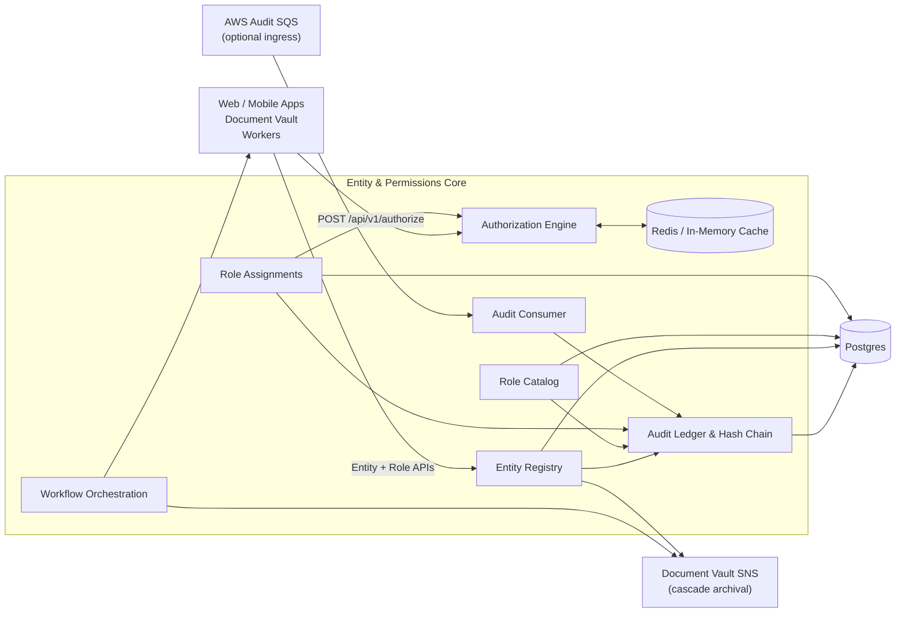

# Entity & Permissions Core – Overview

The Entity & Permissions Core (EPR) is the backstage crew for Omen’s tokenized real‑estate platform. It owns the canonical registry of every issuer, property/SPV, offering, investor, and counterparty, and it enforces who has authority to act on top of those entities. Downstream services—Document Vault, workflow orchestration, tokenization workers, and the investor/issuer apps—call into EPR for three things:

1. **Entity graph** – hierarchical metadata that other apps render or build workflows around.
2. **Role + assignment services** – reusable permission bundles tied to principals (users, services, systems) with optional entity scope and effective/expiry windows.
3. **Stateless authorization** – a single `POST /api/v1/authorize` endpoint that answers “can this principal take this action on this entity?” in milliseconds, backed by caching and a tamper‑evident audit trail.

Everything that mutates data is logged to the hash‑chained audit ledger, and entity archival emits SNS events consumed by Document Vault to cascade document deletions.

---

## System responsibilities



### Key capabilities

| Capability | What it unlocks for designers/front‑end devs |
|------------|----------------------------------------------|
| Entity registry | Render issuer → offering → property → investor trees, build breadcrumbs, and drive wizard flows with JSON attributes. |
| Role catalog | Let admins provision reusable permission bundles; limit which entity types each role can attach to (`scope_types`). |
| Assignments | Model “Alice is a compliance officer for Issuer A until 2026‑01‑01” and show upcoming access revocations. |
| Stateless authorization | Call `POST /api/v1/authorize` before exposing actions/data in any UI; answers are cache‑friendly. |
| Audit & automation | Every change is hash‑chained for compliance. Entity archival publishes SNS events that Document Vault consumes to clean up documents. |

---

## How you build on top of EPR

### 1. Model entities

- `POST /api/v1/entities` with `type`, `name`, optional `parent_id`, and arbitrary JSON `attributes`.
- `GET /api/v1/entities` filters by type/parent; `GET /api/v1/entities/{id}` returns full metadata.
- `PATCH /api/v1/entities/{id}` updates names, hierarchy, or attributes.
- `POST /api/v1/entities/{id}/archive` soft‑archives and emits an SNS event for downstream cascade delete (Document Vault listens to this topic).

### 2. Define roles and permissions

- `POST /api/v1/roles` creates roles with `permissions` (string identifiers) and `scope_types`.
- `GET /api/v1/roles` enumerates roles (system + custom); `PATCH /api/v1/roles/{id}` updates descriptions, scopes, or permission membership.

### 3. Assign roles to principals

- `POST /api/v1/assignments` with `principal_id`, `principal_type`, `role_id`, optional `entity_id`, and optional `effective_at` / `expires_at`.
- `GET /api/v1/assignments?principal_id=&entity_id=` drives access-management screens.
- `DELETE /api/v1/assignments/{id}` revokes access.

### 4. Authorize actions in any service/UI flow

- `POST /api/v1/authorize` with `{ user_id, action, resource_id, principal_type }`.
- The engine evaluates assignments, inherited permissions across the entity hierarchy, scope rules, and active windows. The response is `{ "authorized": true | false }`.
- Answers are cached in Redis (Upstash) when configured; cache invalidates automatically when roles/assignments change.

### 5. Audit and automation hooks

- All mutations write to `audit_logs` using a SHA‑256 hash chain.
- The optional SQS **Audit Consumer** ingests upstream records and writes them using the same ledger.
- Entity archival publishes to the Document Vault SNS topic so the document service can cascade archival.

---

## Data model quick reference

| Table | Purpose |
|-------|---------|
| `entities` | `id`, `type`, `name`, `status`, `parent_id`, JSON `attributes`, timestamps. |
| `roles` | `id`, `name`, `description`, `is_system`, JSON `scope_types`, timestamps. |
| `permissions` | `id`, `action`, `description`. |
| `role_permissions` | join table between roles and permission actions. |
| `role_assignments` | `principal_id`, `principal_type`, optional `entity_id`, `role_id`, `effective_at`, `expires_at`, timestamps. |
| `audit_logs` | `sequence`, `previous_hash`, `entry_hash`, actor/entity context, JSON `details`. |
| `processed_events` | dedup table for consumed audit SQS/SNS events. |

---

## Design & integration checklist

1. **Plan UI around the entity tree** – fetch children/parents via query params, display attributes inline.
2. **Always preflight** sensitive actions with `POST /api/v1/authorize` (Document Vault, investor dashboards, workflow tasks, etc.).
3. **Handle error modes** – `403` (not authorized), `404` (entity missing), `503` (EPR unreachable). Decide whether to fail closed or show fallback content.
4. **Batch operations** – orchestrate bulk role assignments or entity updates client‑side/server‑side; the API is REST-first.
5. **Subscribe to events** if you need to react to entity archival; Document Vault already listens to the SNS topic for cascade deletion.

---

## API Quick Start

This section highlights the surface area you’ll hit most often, with sample payloads and expected responses.

### Entities

```http
POST /api/v1/entities
Content-Type: application/json

{
  "type": "issuer",
  "name": "Atlas Capital",
  "parent_id": null,
  "attributes": {
    "country": "US",
    "registration": "DE-12345"
  }
}
```

**Responses**

- `201 Created` with the stored entity.
- `409 Conflict` if `name + type` already exists.
- `PATCH /api/v1/entities/{id}` accepts partial updates (`name`, `status`, `parent_id`, `attributes`).
- `POST /api/v1/entities/{id}/archive` returns the archived record and emits downstream events.

### Roles

```http
POST /api/v1/roles
Content-Type: application/json

{
  "name": "issuer_compliance_officer",
  "description": "Can verify documents and approve onboarding tasks",
  "scope_types": ["issuer", "offering"],
  "permissions": [
    "document:verify",
    "workflow:approve_onboarding"
  ]
}
```

- `GET /api/v1/roles` returns all roles with their permissions and scopes.
- `PATCH /api/v1/roles/{id}` updates description, scope, or permission membership (all edits logged).

### Role Assignments

```http
POST /api/v1/assignments
Content-Type: application/json

{
  "principal_id": "207c99b1-b5ad-4bd8-9a8d-e08a6d5f1f5f",
  "principal_type": "user",
  "role_id": "2fba0fb1-e6f3-4f61-8a52-6a9bba20c155",
  "entity_id": "b5bcb32e-0c67-4dd6-84a4-8d954c07bd14",
  "effective_at": "2025-01-01T00:00:00Z",
  "expires_at": null
}
```

- `GET /api/v1/assignments?principal_id=…&entity_id=…` drives access-management views.
- `DELETE /api/v1/assignments/{id}` revokes access (idempotent).

### Authorization

```http
POST /api/v1/authorize
Content-Type: application/json

{
  "user_id": "207c99b1-b5ad-4bd8-9a8d-e08a6d5f1f5f",
  "action": "document:upload",
  "resource_id": "b5bcb32e-0c67-4dd6-84a4-8d954c07bd14",
  "principal_type": "user"
}
```

**Response**

```json
{ "authorized": true }
```

- `404 Not Found` if the entity/resource is missing.
- `503`/`504` style errors should be treated as “authorization service unavailable”; fail closed for sensitive flows.

### Audit & Health

- `GET /healthz` – lightweight liveness probe for ECS/Kubernetes health checks.
- (Internal) audit entries are emitted automatically on every mutating call; no client interaction required.

### Headers to know

- `X-Actor-Id` – optional header on mutating routes to attribute who performed the action in the audit ledger. If omitted, the service logs “system”.

---

## Related services

- **Document Vault** – consumes the SNS topic emitted by entity archival and calls `/api/v1/authorize` for upload/download/verify flows.
- **Workflow orchestration** – uses entity metadata and authorization to route tasks (e.g., property onboarding, document verification flows).
- **Tokenization services** – rely on the entity hierarchy and assignments to enforce who can mint, list, or trade property-backed tokens.

---

*Last updated: 2025-11-14*
